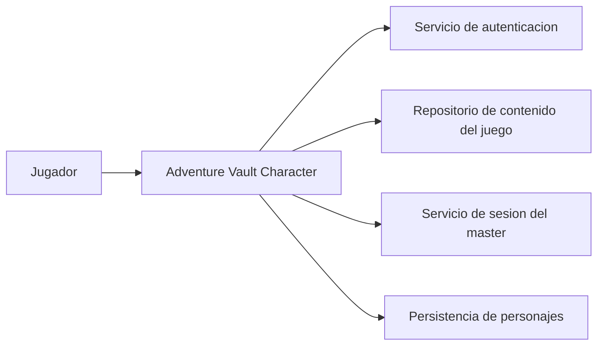

# 03. Context And Scope

## Alcance inicial

Adventure Vault cubre la experiencia del jugador para:

- autenticarse
- crear personajes mediante una guia asistida
- consultar y gestionar personajes existentes
- visualizar contenido gratuito y contenido importado
- conectarse a una sesion del master
- actualizar el estado del personaje durante la sesion

## Fuera de alcance por ahora

- Gestion completa de la aplicacion del master
- Marketplace o distribucion de contenido
- Soporte completo para multiples sistemas desde la primera version

## Contexto del sistema

## Relacion con otros sistemas

- `Servicio de autenticacion`: valida identidad y acceso.
- `Repositorio de contenido del juego`: provee clases, razas, spells, items y monstruos.
- `Servicio de sesion del master`: sincroniza el estado del personaje durante una partida.
- `Persistencia de personajes`: conserva progreso, inventario, experiencia y decisiones del jugador.
