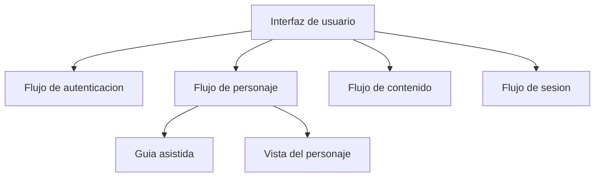

# Component View App

## Componentes propuestos del cliente

## Responsabilidades

- `Flujo de autenticacion`: acceso del jugador.
- `Flujo de personaje`: creacion, consulta y actualizacion.
- `Guia asistida`: apoya alta de personaje y subida de nivel.
- `Vista del personaje`: presenta estado jugable actual.
