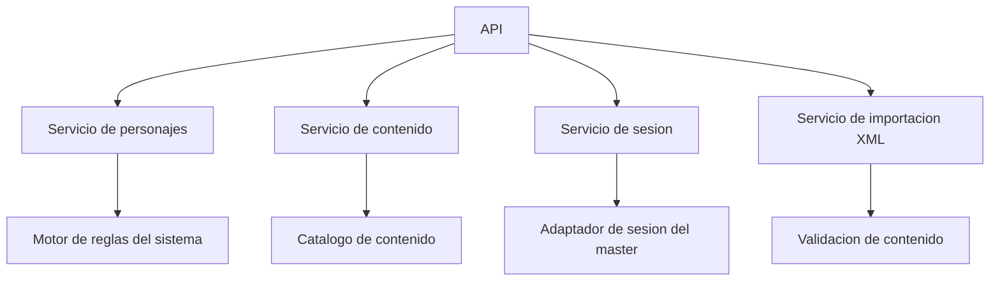

# Component View Backend

## Componentes propuestos del backend

## Responsabilidades

- `Servicio de personajes`: gestiona estado y progreso.
- `Motor de reglas del sistema`: encapsula reglas del juego.
- `Servicio de contenido`: entrega catalogos disponibles.
- `Servicio de importacion XML`: valida e integra contenido agregado.
- `Servicio de sesion`: coordina el intercambio con el contexto del master a traves de un adaptador aislado.
