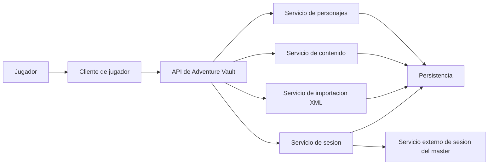

# Container View

## Contenedores iniciales

## Interpretacion

- `Cliente de jugador`: interfaz principal del usuario.
- `API de Adventure Vault`: punto de entrada de la logica de aplicacion.
- `Servicio de sesion`: capacidad interna de integracion desde la app del jugador.
- `Servicio externo de sesion del master`: sistema fuera del alcance actual del repositorio.
