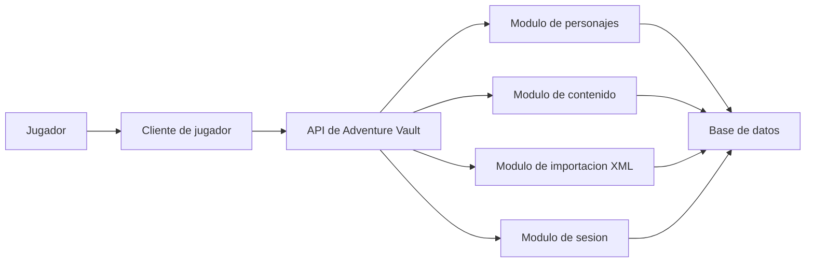

# Container View

## Contenedores iniciales

## Interpretacion

- `Cliente de jugador`: interfaz principal del usuario.
- `API de Adventure Vault`: punto de entrada de la logica de aplicacion.
- `Modulos internos`: separaciones conceptuales que pueden vivir dentro de un mismo despliegue al inicio.
