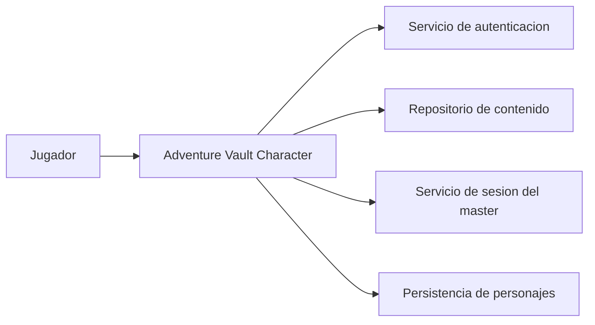

# System Context

## Descripcion

Adventure Vault Character sirve al jugador y se integra con servicios de autenticacion, contenido, persistencia y sesion.

## Responsabilidades

- El jugador interactua solo con la app de personaje.
- La app coordina acceso, consulta de contenido y actualizacion de estado.
