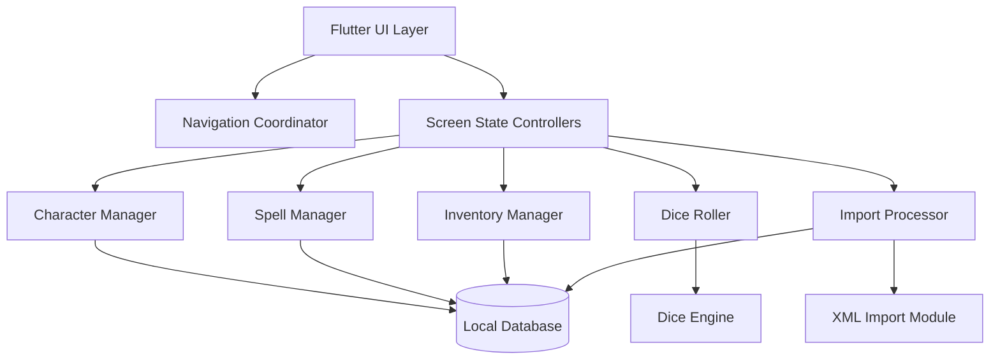

# Component Diagram Description

This file is a lightweight component view of the Flutter app. The source of
truth for component responsibilities remains
[../architecture/05-building-block-view.md](../architecture/05-building-block-view.md).

## C4 Level 3 Components Inside the Flutter App

## Responsibilities

- Flutter UI Layer: declarative screen rendering and reusable widgets.
- Navigation Coordinator: route definitions and screen transitions.
- Screen State Controllers: screen state and user intent handling.
- Character Manager: character lifecycle and derived character data access.
- Dice Roller: prepares roll requests and uses the Dice Engine.
- Spell Manager: spell-related state and queries.
- Inventory Manager: item state and equipment effects.
- Import Processor: imported content orchestration, validation, and
  persistence.
