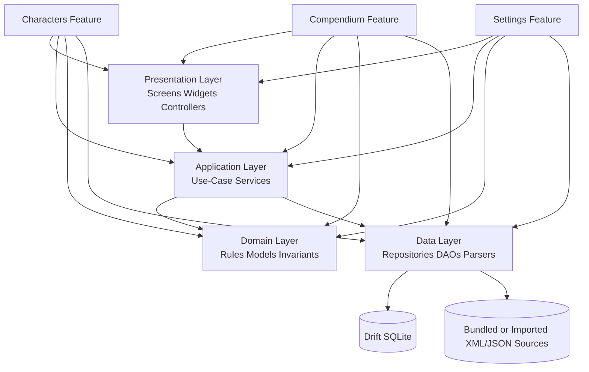

# Component Diagram Description

This file provides a lightweight C4 Level 3 view of the Flutter app.
Canonical component responsibilities live in
[../architecture/05-building-block-view.md](../architecture/05-building-block-view.md).

## C4 Level 3 Components Inside the Flutter Client

## Responsibilities

- **Presentation Layer**: declarative rendering, route composition, user intents.
- **Application Layer**: workflow orchestration and transaction-like use cases.
- **Domain Layer**: deterministic gameplay rules and invariant evaluation.
- **Data Layer**: local persistence, compendium import mapping, repository
  implementations.
- **Feature Modules**: keep these layers close to each feature capability,
  avoiding cross-feature rule leakage.
