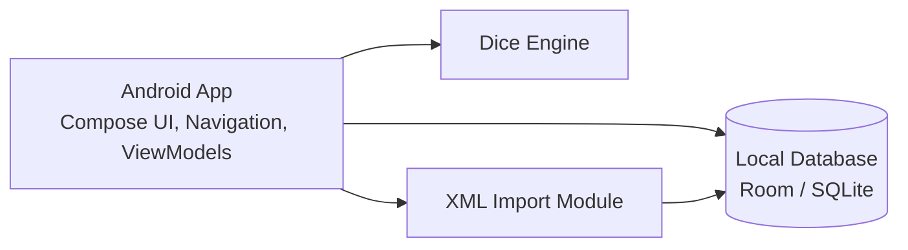

# Container Diagram Description

This file is a lightweight container view. The source of truth for container
responsibilities remains
[../architecture/05-building-block-view.md](../architecture/05-building-block-view.md).

## C4 Level 2 Containers

## Responsibilities

- Android App: renders Compose screens, manages navigation, and coordinates use
  cases through screen state.
- Dice Engine: performs D20 mechanics and modifier application.
- XML Import Module: validates, parses, and maps imported rules content.
- Local Database: stores characters, inventory, spells, imported content, and
  supporting metadata.
