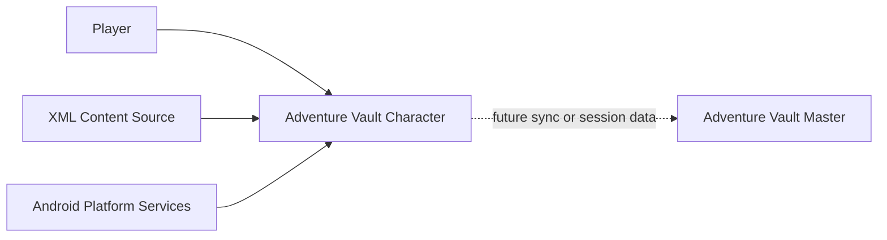

# Context Diagram Description

This file is a lightweight diagram view of the system context. The source of
truth for scope and boundaries remains
[../architecture/03-context-and-scope.md](../architecture/03-context-and-scope.md).

## C4 Level 1 Context

## Relationships

- Player uses the app on a single Android device.
- XML content is imported from user-selected files.
- Adventure Vault Master remains an external future peer system.
- Android platform services host application lifecycle, storage, and execution.
